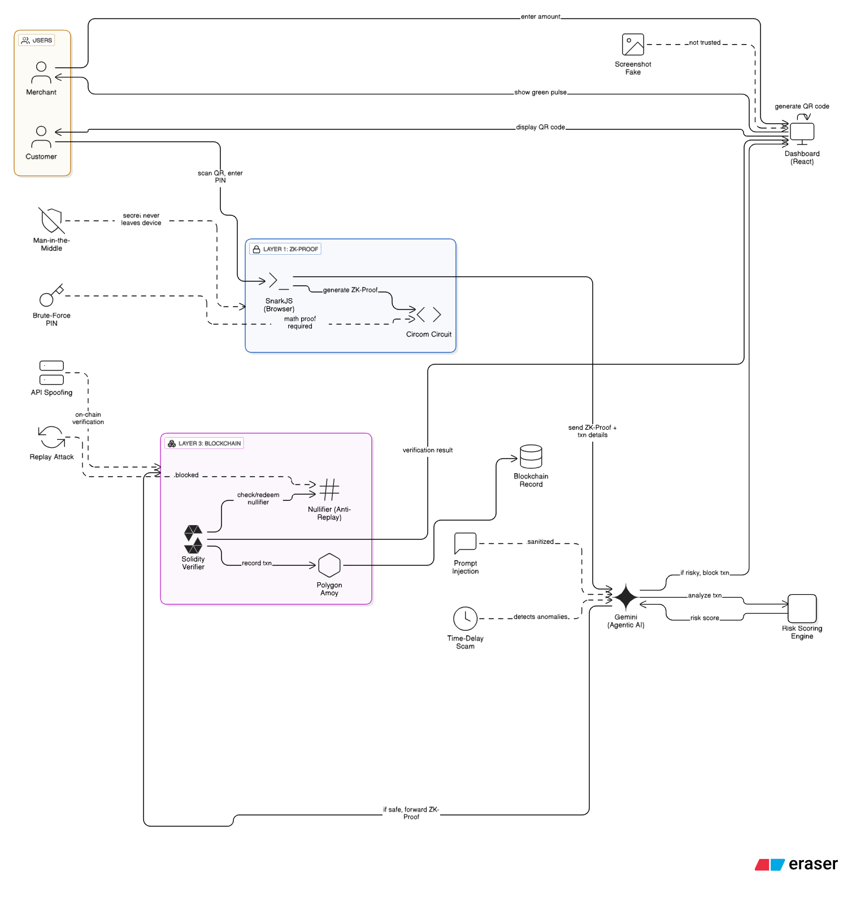

# ZKPulse - Zero-Knowledge Payment Verification

A blockchain-powered payment system with AI voice assistant that enables secure, privacy-preserving payment verification using Zero-Knowledge proofs.

## Architecture



```
┌─────────────────────────────────────────────────────────────┐
│                    FRONTEND (React)                         │
│  • Voice Input/Output (Web Speech API)                      │
│  • Merchant Dashboard with QR Generation                    │
│  • Customer Payment Flow                                    │
└─────────────────────────────────────────────────────────────┘
                              │
                              ▼
┌─────────────────────────────────────────────────────────────┐
│                    BACKEND (Express.js)                     │
│  • Gemini AI Integration (gemini-2.5-flash)                 │
│  • PIN Registry & Transaction APIs                         │
│  • ZK Proof Verification                                    │
└─────────────────────────────────────────────────────────────┘
                              │
                              ▼
┌─────────────────────────────────────────────────────────────┐
│                    BLOCKCHAIN (Polygon)                     │
│  • ZK Circuits (Poseidon hash PIN verification)             │
│  • PaymentVerifier Smart Contract                           │
│  • Groth16 Proof System                                     │
└─────────────────────────────────────────────────────────────┘
```

---

## SETUP

### Prerequisites
- Node.js 18+
- Gemini API Key ([Get free key](https://ai.google.dev))

### 1. Setup Environment

```bash
git clone <repo>
cd zkpulse
cp backend/.env.example backend/.env
# Edit backend/.env with your GEMINI_API_KEY
```

### 2. Start Backend

```bash
cd backend
npm install
npm start
# Runs on http://localhost:5000
```

### 3. Start Frontend (new terminal)

```bash
cd frontend
npm install
npm start
# Runs on http://localhost:3000
```

### Docker Alternative

```bash
docker-compose up --build
# Access at http://localhost:3000
```

---

## Project Structure

```
zkpulse/
├── backend/
│   ├── src/index.js          # Express server + Gemini AI
│   └── package.json
├── frontend/
│   ├── src/
│   │   ├── App.js            # Customer payment flow
│   │   └── MerchantPageEnhanced.js  # Merchant dashboard
│   └── package.json
├── circuits/
│   ├── auth.circom           # ZK circuit (PIN verification)
│   └── setup.sh/setup.bat    # Circuit setup scripts
├── blockchain/
│   ├── contracts/
│   │   ├── PaymentVerifier.sol
│   │   └── Verifier.sol      # Auto-generated from circuit
│   └── hardhat.config.js
└── docker-compose.yml
```

---

## Features

### Merchant Dashboard
- Generate payment QR codes
- View transaction history with stats
- AI voice assistant for transaction queries
- Real-time transaction tracking

### Customer Payment Flow
- Register PIN (creates Poseidon hash)
- Sign in with existing PIN
- Authorize payments with ZK proof

### Zero-Knowledge PIN Verification

The system proves PIN knowledge without revealing the PIN:

```
Customer Phone (Offline):
1. User enters PIN
2. ZK Circuit: Poseidon(PIN + Salt) == stored pinHash
3. Generate proof (PIN never leaves device)
4. Send proof to backend for verification
```

---

## API Endpoints

| Endpoint | Method | Description |
|----------|--------|-------------|
| `/api/health` | GET | Health check |
| `/api/register-pin` | POST | Register customer PIN hash |
| `/api/verify-proof` | POST | Verify ZK proof for payment |
| `/api/gemini` | POST | AI chat for transaction queries |
| `/api/transactions` | GET | Get transaction history |
| `/api/transactions` | POST | Record new transaction |

---

## ZK Circuit Setup

```bash
cd circuits

# Unix/macOS
./setup.sh

# Windows
setup.bat
```

This generates:
- `auth.r1cs` - Circuit constraints
- `auth_0000.zkey` - Proving key (keep secret)
- `verification_key.json` - For backend verification
- `Verifier.sol` - For on-chain verification

---

## Blockchain Deployment

```bash
cd blockchain
npm install
npm run compile

# Deploy to Polygon Amoy testnet
npm run deploy:amoy
```

Required in `.env`:
```
PRIVATE_KEY=your_wallet_private_key
POLYGON_RPC_URL=https://rpc-amoy.polygon.technology
```

---

## Environment Variables

### Backend (.env)
```
GEMINI_API_KEY=your_gemini_api_key
PORT=5000
```

### Blockchain (.env)
```
PRIVATE_KEY=wallet_private_key
POLYGON_RPC_URL=https://rpc-amoy.polygon.technology
```

---

## Testing

```bash
# Backend health
curl http://localhost:5000/api/health

# Test Gemini AI
curl -X POST http://localhost:5000/api/gemini \
  -H "Content-Type: application/json" \
  -d '{"messages":[{"role":"user","content":"What are my transactions today?"}]}'
```

---

## Common Issues/Limitations

| Issue | Solution |
|-------|----------|
| Port in use | `taskkill /F /IM node.exe` (Windows) or `pkill node` (Unix) |
| Gemini 404 | Verify API key and model name |
| Module not found | Run `npm install` in the directory |
| Docker slow | Use `docker-compose build --no-cache` |

---

## Tech Stack

- **Frontend**: React, Web Speech API, QRCode
- **Backend**: Express.js, Google Gemini AI
- **Blockchain**: Solidity, Hardhat, Polygon
- **ZK Proofs**: Circom, snarkjs, Groth16
- **Auth**: Poseidon hashing, localStorage

---

## License

MIT
