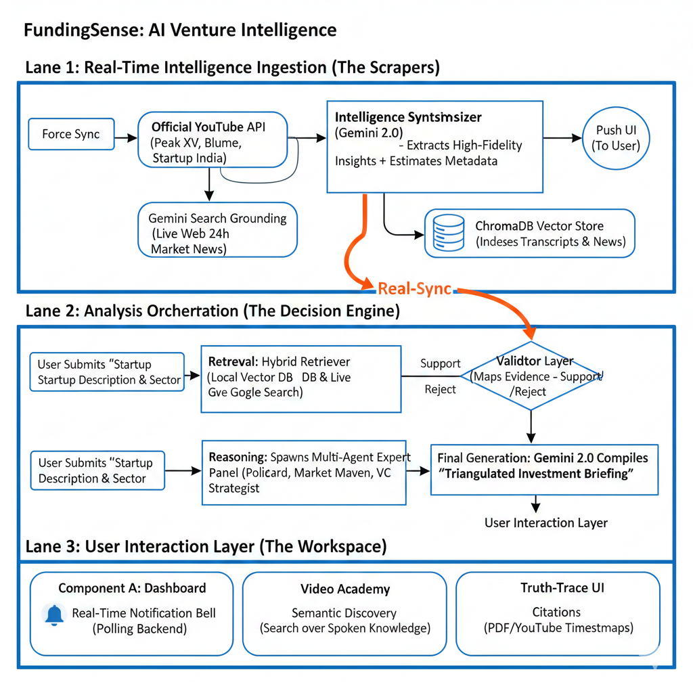
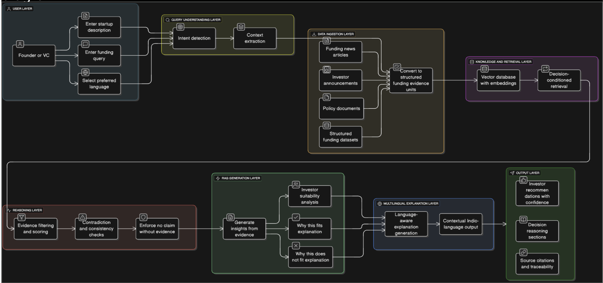
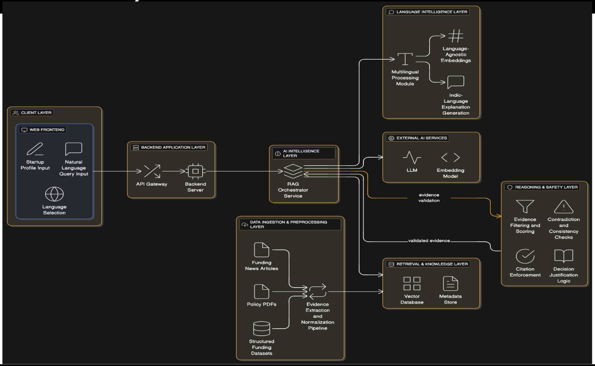

# FundingSense: The Ultimate AI Venture Intelligence Suite 

**FundingSense** is a state-of-the-art, evidence-backed decision intelligence platform designed to bridge the data gap between startups and investors. By combining a sophisticated **Multi-Agent Reasoning Engine** with **Google Gemini 2.0 Flash**, it provides founders with deep, verifiable insights grounded in real-time policy, news, and multimodal video intelligence.

---





## Real-Time Intelligence Core

FundingSense has evolved from a static RAG app into a **Living Intelligence Engine**.

### Multimodal Video Academy
*   **Transcript-RAG**: Automatically indexes official startup webinars, founder talks, and VC masterclasses from YouTube.
*   **Semantic Search**: Query through thousands of hours of spoken expertise as if it were text.
*   **AI Synthesis**: Gemini extracts 3-5 high-fidelity strategic insights from every video, saving hours of viewing.

### Automated Intelligence Scraper
*   **Dual-Discovery Engine**: Uses the **Official YouTube Data API** for accurate video links and **Google Search Grounding** for latest news.
*   **Market Intel Digest**: Periodically scans the web for the top 3 most significant Indian funding stories or policy shifts from the last 24 hours.
*   **Auto-Sync**: One-click "Intelligence Refresher" in user settings to populate the entire platform with today's trends.

### Global Notification System
*   **Real-Sync Alerts**: Instant visual alerts for Market Intelligence, Academy Updates, and Analysis Completion.
*   **Glassmorphic Pulse UI**: Persistent bell icon with live updates—never miss a funding trend or a finished report.

### SafeGuard Fraud Detection
*   **AI-Forensic Background Analysis**: Checks startups and investors against real-time regulatory databases, scam reports, and news.
*   **Risk Scoring Engine**: Assigns a 0-100 credibility score with explicit red flags (e.g., "Fake Investor", "Past Lawsuits").
*   **Integrated Warning System**: Automatically penalizes analysis scores if the entity is flagged as high-risk.

---

## Core AI Innovations

### 1. Multi-Agent "Consensus" Reasoning (Expert Panel)
FundingSense spawns three specialized AI agents for every analysis:
-   **Policy Guard**: Analyzes government schemes, regulatory tailwinds (e.g., DSIR policy shifts), and compliance.
-   **Market Maven**: Evaluates sector growth, competition, and "Why Now?" factors using live news grounding.
-   **VC Strategist**: Simulates the investor mindset, focusing on funding fit, exit potential, and thesis alignment.

### 2. The Reasoning & Safety Layer (Factual Integrity)
Unlike standard RAG apps, we implement a **tri-stage validation pipeline**:
-   **Contextual pillars**: Breaking down startup descriptions into logical market components.
-   **Evidence Mapping**: A dedicated engine ensures every claim is verified against a retrieved source.
-   **Conflict Detection**: Automatically flags when expert agents disagree, providing a nuanced risk assessment.

### 3. Truth-Trace Visual Grounding
Every report is "grounded." You don't just get an answer; you get **proof**.
-   **Direct Citations**: Clickable source tags linking directly to news articles, policy PDFs, or YouTube videos.
-   **Grounding Trace**: Transparent log of which "Thought Pillar" used which piece of evidence.

---

## Multilingual Intelligence
Full UI and report generation support for **English + 7 major Indian languages**, including Hindi, Bengali, Tamil, Telugu, Marathi, Gujarati, and Kannada.

---

## Tech Stack & Architecture

### **Powering the Intelligence**
-   **LLM**: Google Gemini 2.0 Flash (v1beta with Google Search Grounding).
-   **Vector DB**: ChromaDB (Semantic storage for videos and policy docs).
-   **Backend**: FastAPI (Async Python) with Pydantic for strict schema enforcement.
-   **Frontend**: React 18, Vite, TypeScript, Framer Motion, and Tailwind CSS.
-   **Auth & Realtime**: Supabase + Custom In-Memory Sync for alerts.

### **Project Structure**
```bash
├── backend/
│   ├── app/
│   │   ├── core/           # Orchestration & Multi-Agent Logic
│   │   ├── rag/            # Vector Engine & Video Scraper (YT API + Grounding)
│   │   ├── services/       # Real-Time Market Intel Digest
│   │   ├── api/            # Academy & Notification Endpoints
│   │   └── data/           # Raw Evidence Store (PDFs/MDs)
├── frontend/
│   ├── src/
│   │   ├── pages/          # Dashboard, Video Academy, Analyze, Settings
│   │   ├── components/     # NotificationBell, ExpertPanel, UI Library
│   │   └── services/       # API Integration & Authentication
```

---

## Setup & Installation

### 1. Backend Setup
```bash
cd backend
python -m venv venv
source venv/bin/activate
pip install -r requirements.txt
cp .env.example .env
# Required: GOOGLE_API_KEY, YOUTUBE_API_KEY
uvicorn app.main:app --reload
```

### 2. Frontend Setup
```bash
cd frontend
npm install
cp .env.example .env
# Setup: VITE_API_URL, SUPABASE_URL, SUPABASE_ANON_KEY
npm run dev
```

### 3. Sync Intelligence
Go to **Settings** in the dashboard and click **"Force Intelligence Sync"** to populate your local database with the latest startup market data.

---

## Test Credentials & Demo Mode

### Quick Access (No Login Required)
You can explore the full application without creating an account by clicking **"View Demo Dashboard"** on the landing page. This demo mode provides access to all features including:
- Analysis history and statistics
- Fraud detection tools
- AI Chat Assistant
- Video Academy
- Intelligence Hub

### Test Account (Optional)
If you prefer to test with authentication:
- **Email**: `demo@fundingsense.ai`
- **Password**: `DemoUser2024!`

**Note**: In production deployment, authentication is handled via Supabase. For local testing without Supabase setup, the app automatically allows demo access.

---

### 4. Docker Setup (Recommended)
This approach runs both the frontend and backend services in isolated containers.

**Prerequisites:**
- Docker & Docker Compose installed
- `.env` files configured in `frontend/` and `backend/`

```bash
# Build and run the entire stack from the project root
docker-compose -f infra/docker-compose.yml up --build
```
- Frontend will be available at: http://localhost:5173 (or port 80 based on mapping)
- Backend API will be available at: http://localhost:8000

---

## Deployment & Docker Hub

To publish these images to Docker Hub (as per submission requirements):

1.  **Login to Docker Hub:**
    ```bash
    docker login
    ```
2.  **Build & Push Images:**
    Replace `<your-username>` with your actual Docker Hub username.
    ```bash
    # Backend
    docker build -t <your-username>/fundingsense-backend ./backend
    docker push <your-username>/fundingsense-backend

    # Frontend
    docker build -t <your-username>/fundingsense-frontend ./frontend
    docker push <your-username>/fundingsense-frontend
    ```

---

## Assumptions and Limitations

### Assumptions
1.  **API Quotas**: The system assumes reliable access to Google Gemini API and YouTube Data API. Rate limits may affect "Intelligence Sync" features.
2.  **Internet Connectivity**: Grounding features (Search & Video RAG) require an active internet connection to function.
3.  **Data Persistence**: User analysis history and chat logs are stored in local JSON files (`backend/data/`). In a production environment, this would be replaced by a PostgreSQL database.
4.  **Single User**: The current iteration is optimized for single-tenant usage (locally hosted), though it supports multi-user logic via Supabase Auth.

### Limitations
1.  **Video Processing**: The "Video Academy" currently indexes metadata and transcripts. Full video frame analysis is limited to avoid excessive token usage.
2.  **Language Support**: While the UI supports 8 languages, the Video Academy search is primarily optimized for English and Hindi content.
3.  **Sync Latency**: The "Real-Time Intelligence Sync" can take 30-60 seconds depending on the volume of new market data found.

---

## Project Structure (For Submission)
This repository is structured to be "Code-Complete" and "Deploy-Ready":

*   `infra/`:
    *   `docker-compose.yml`: Orchestration for Frontend (React/Nginx) and Backend (FastAPI).
*   `backend/`:
    *   `Dockerfile`: Python 3.11 Slim image.
    *   `app/`: Core application logic, RAG engine, and API services.
*   `frontend/`:
    *   `Dockerfile`: Node 20 Build -> Nginx Alpine Serve.
    *   `src/`: Full React application source.

---
